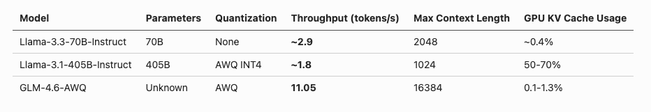
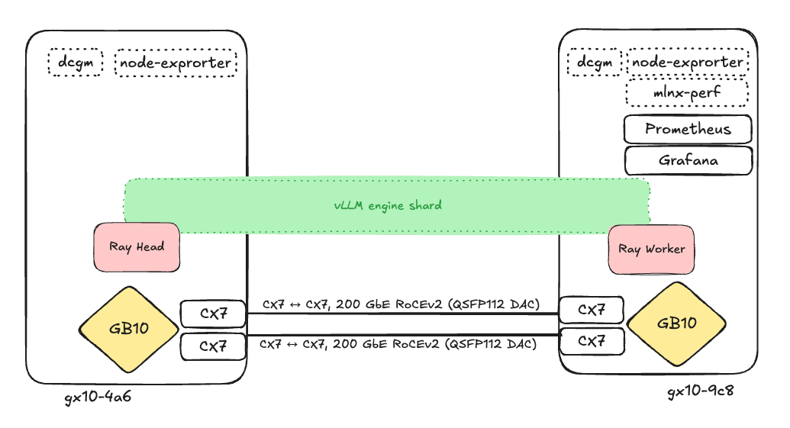
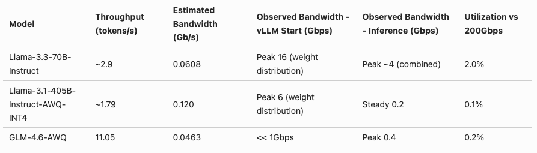
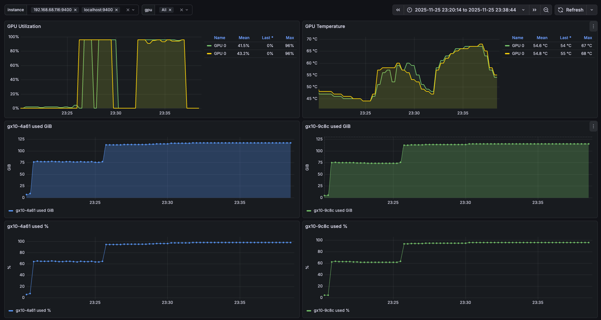
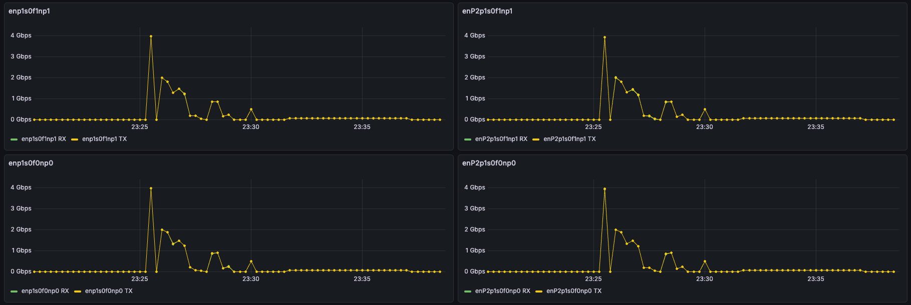
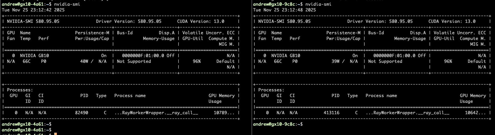
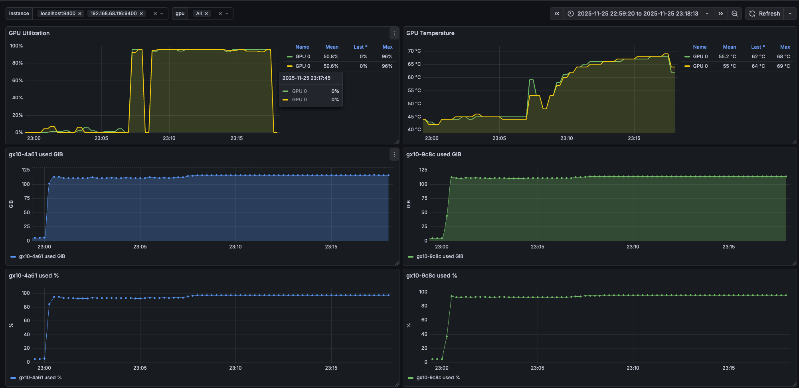
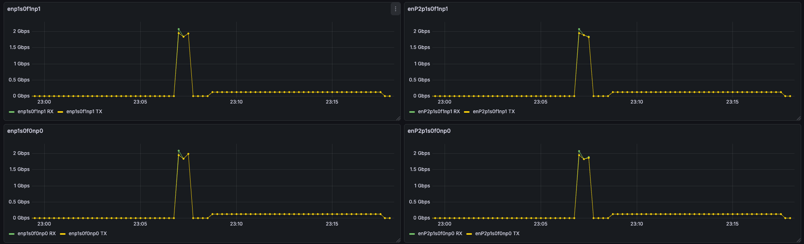
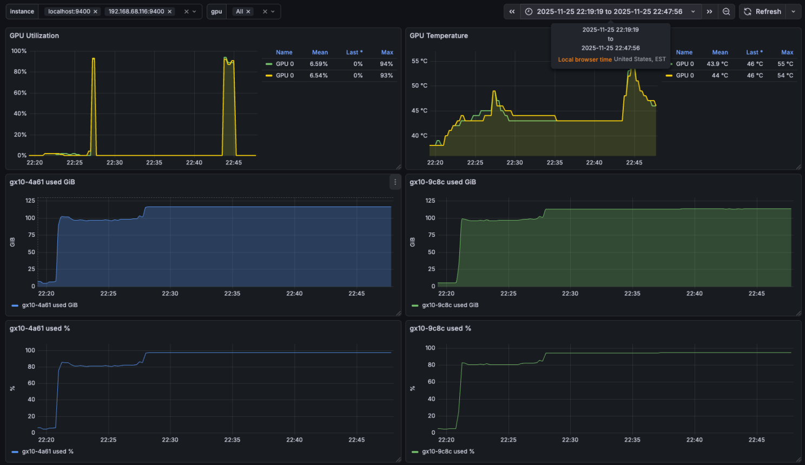
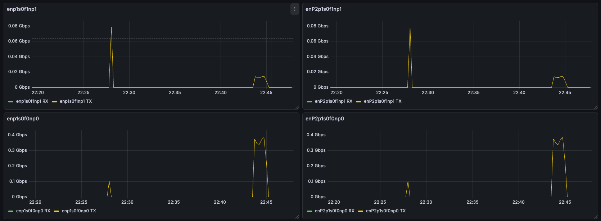

# Testing Three Models on Two Sparks

**Author:** Andrew Myers  
**Published:** December 1, 2025

I evaluated the performance of three models on a dual-node DGX Spark
setup. The goal is to understand how language models perform when
distributed across two nodes using tensor parallelism. Specifically, I
measure throughput in tokens per second, analyze link usage between
the DGXs and compare it to predicted values, and observe GPU and
memory usage during both inference and model loading.

There's an ongoing discussion on NVIDIA forum about pushing NCCL
performance to maximum over 200Gbps link between Sparks. People
test different configurations - single cable with port aggregation, two
cables, trying to reach full 200Gbps bandwidth. I measured how much
bandwidth inference actually needs.

This builds on previous work: DGX Spark First Impression covered initial
setup and single-node performance, while Connecting Two Sparks
detailed the multi-node configuration. This post focuses on actual
model performance metrics.

Three models under evaluation:

1. `meta-llama/Llama-3.3-70B-Instruct` — 70 billion parameter model from Meta
2. `hugging-quants/Meta-Llama-3.1-405B-Instruct-AWQ-INT4` — Quantized 405B parameter model using AWQ INT4 quantization


3. `QuantTrio/GLM-4.6-AWQ` — Quantized GLM model using AWQ quantization

## Key Findings

1. **Best Performance:** GLM-4.6-AWQ gets **11.05 tokens/s** — highest throughput in this dual-node setup, nearly 4x faster than Llama-3.3-70B.
2. **Model Architecture Impact:** GLM's Mixture of Experts (MoE) architecture gives much better performance even with similar or larger model size compared to dense models.
3. **Memory Usage Patterns:**
   - Llama-3.3-70B: Very low KV cache usage (~0.4%), shows high concurrency potential
   - Llama-3.1-405B: High KV cache usage (50–70%), limits concurrent requests
   - GLM-4.6-AWQ: Low KV cache usage (0.1–1.3%) even with large allocated cache (16.85 GiB / 13.43 GiB per node), good for long context length
4. **Model Size Impact:** Even with INT4 quantization, 405B model is slower (1.8 tokens/s) than 70B model. Model size affects inference speed a lot in dense architectures.
5. **Network Usage:** ~134 Mbps seen during inference on interconnect. This approximately matches expected bandwidth for tensor parallelism communication patterns.
6. **Context Length:** Spark memory lets me fit much longer context for GLM-4.6-AWQ (16,384 tokens) compared to Llama models. For other models, I had to tune `max_model_len` when starting vLLM, otherwise I got memory allocation errors.

```
(EngineCore_0 pid=2495) ValueError: To serve at least one request with
the model's max seq len (256), 0.12 GiB KV cache is needed, which is
larger than the available KV cache memory (0.04 GiB). Based on the
available memory, the estimated maximum model length is 80. Try
increasing gpu_memory_utilization or decreasing max_model_len when
initializing the engine.
```

This shows that GLM-4.6-AWQ's MoE architecture uses memory better,
letting longer context windows fit in Spark's memory.

## Bottom Line

GLM-4.6-AWQ gives best throughput (11.05 tokens/s) for this dual-node
DGX Spark setup, showing that MoE architecture can get much better
performance than dense models. Llama-3.3-70B shows good
performance (2.9 tokens/s) with very low memory usage, while larger
dense models like 405B show slower inference speeds even with
quantization.



## Infrastructure Setup

Models are stored using Hugging Face cache system. Total storage:
698.4G across 3 models. This almost fully used Spark NVMe drives on
both nodes (1TB as specified in DGX Spark specifications).

- **Ray Head Node (gx10-4a61):** 750G used (87% usage), 120G free
- **Ray Worker Node (gx10-9c8c):** 702G used (81% usage), 168G free

## Cluster Configuration

Dual-node setup uses Ray for distributed execution with vLLM serving.
Configuration follows NVIDIA Spark vLLM stacked Sparks guide for
multi-node tensor parallelism.

I modified `run_cluster.sh` from vLLM repository to fix Ray network
interface binding. Added `--node-ip-address=${HEAD_NODE_ADDRESS}`
to Ray start command because Ray was getting confused with WiFi
interface and needed static binding to backend network interface.

**Network Interface Configuration:**

Started with single interface as recommended by playbook:

```bash
export MN_IF_NAME=enp1s0f0np0
```

Then moved to all four interfaces to use full 400Gbps bandwidth:

```bash
export MN_IF_NAME=enp1s0f0np0,enp1s0f1np1,enP2p1s0f0np0,enP2p1s0f1np1
```

Using four interfaces made all of them active, but did not lead to any
performance increase. Link usage is very small compared to 200Gbps
available bandwidth, so spreading traffic across multiple links did not
give benefits. All tests were performed with four interfaces configuration.

Only two environment variables need to be set:

- `MN_IF_NAME` (as shown above)
- `VLLM_IMAGE=nvcr.io/nvidia/vllm:25.09-py3`

**Head Node:**



```bash
run_cluster.sh $VLLM_IMAGE 10.77.1.1 --head ~/.cache/huggingface \
  -e VLLM_HOST_IP=10.77.1.1 \
  -e UCX_NET_DEVICES=$MN_IF_NAME \
  -e NCCL_SOCKET_IFNAME=$MN_IF_NAME \
  -e OMPI_MCA_btl_tcp_if_include=$MN_IF_NAME \
  -e GLOO_SOCKET_IFNAME=$MN_IF_NAME \
  -e TP_SOCKET_IFNAME=$MN_IF_NAME \
  -e RAY_memory_monitor_refresh_ms=0 \
  -e MASTER_ADDR=10.77.1.1
```

**Worker Node:**

```bash
run_cluster.sh $VLLM_IMAGE 10.77.1.1 --worker ~/.cache/huggingface \
  -e VLLM_HOST_IP=10.77.1.2 \
  -e UCX_NET_DEVICES=$MN_IF_NAME \
  -e NCCL_SOCKET_IFNAME=$MN_IF_NAME \
  -e OMPI_MCA_btl_tcp_if_include=$MN_IF_NAME \
  -e GLOO_SOCKET_IFNAME=$MN_IF_NAME \
  -e TP_SOCKET_IFNAME=$MN_IF_NAME \
  -e RAY_memory_monitor_refresh_ms=0 \
  -e MASTER_ADDR=10.77.1.1
```

## Testing Script

I used a Python script that sends a single request to vLLM API and
measures throughput. It records wall time from request start to
completion, then calculates tokens per second from completion tokens
and elapsed time. I also cross-checked with vLLM logging:

```
(APIServer pid=984) INFO 11-26 03:44:52
[loggers.py:123] Engine 000: Avg prompt throughput:
0.0 tokens/s, Avg generation throughput: 11.5
tokens/s, Running: 1 reqs, Waiting: 0 reqs, GPU KV
cache usage: 1.3%, Prefix cache hit rate: 0.0%
```

> **Note:** `max_tokens` must be set to something less than or equal to
> maximum context length minus prompt token count.

## Monitoring

Monitoring set up using Prometheus and Grafana for network, GPU, and
memory usage on both nodes.

- **dcgm-exporter** (`nvcr.io/nvidia/k8s/dcgm-exporter:4.4.2-4.7.0-ubuntu22.04`) — Used for GPU usage, temperature, and compute metrics. Note: Spark has unified memory architecture, so dcgm reports 0 for memory metrics. Use node-exporter instead for memory monitoring.
- **node-exporter** (`prom/node-exporter:latest`) — Standard Prometheus node exporter. Gives system memory metrics including unified memory usage.
- **Custom mlnx-perf-exporter script** — Prometheus exporter for Mellanox network interface statistics. Uses `ethtool -S` to read `rx_bytes_phy` and `tx_bytes_phy` counters from all four interfaces.

## Traffic Prediction

I used the following estimation to calculate expected network traffic during inference:

- **B:** Batch size (number of sequences decoded in parallel)
- **H:** Hidden size (width of model's activation vector per token)
- **L:** Number of Transformer layers the token traverses
- **bytes_per_element:** Size of each activation value crossing tensor parallelism boundary; FP16/BF16 = 2 bytes, FP32 = 4 bytes
- **α (alpha):** Number of cross-node activation reductions per layer during decode (≈2 for standard tensor parallelism all-reduce/all-gather)

## Model Performance Evaluation

### meta-llama/Llama-3.3-70B-Instruct

A 70 billion parameter model from Meta.

**Configuration:**

```bash
vllm serve meta-llama/Llama-3.3-70B-Instruct \
  --tensor-parallel-size 2 \
  --max-model-len 2048
```




**Throughput:** ~2.9 tokens/s (consistent across multiple runs)

**Test runs:**

1. 1024 completion tokens, 45 prompt tokens, 354.126s wall time → 2.89 tokens/s
2. 1024 completion tokens, 45 prompt tokens, 351.406s wall time → 2.91 tokens/s
3. 979 completion tokens, 45 prompt tokens, 330.275s wall time → 2.96 tokens/s

**Observations:**

- Model loading took about 283 seconds
- GPU KV cache usage: ~0.4%
- Prefix cache hit rate: 0.0%
- Model shows consistent performance around 2.9–3.0 tokens/s
- Network usage during inference shows ~134 Mbps on interconnect

### hugging-quants/Meta-Llama-3.1-405B-Instruct-AWQ-INT4

A quantized 405B parameter model using AWQ INT4 quantization.

**Configuration:**

```bash
vllm serve hugging-quants/Meta-Llama-3.1-405B-Instruct-AWQ-INT4 \
  --tensor-parallel-size 2 \
  --max-model-len 1024 \
  --max-num-seqs 1
```




**Throughput:** ~1.8 tokens/s

**Test runs:**

1. Run 1 (256 max len): 211 completion tokens, 45 prompt tokens, 116.415s wall time → 1.81 tokens/s
2. Run 2 (1024 max len): 979 completion tokens, 45 prompt tokens, 545.560s wall time → 1.79 tokens/s

**Observations:**

- Even with INT4 quantization, 405B parameter model is much slower than 70B model
- GPU KV cache usage: 50–70% (much higher than Llama-3.3-70B)
- Prefix cache hit rate: 35.6%
- Larger model size (405B vs 70B) results in slower inference even with quantization

### QuantTrio/GLM-4.6-AWQ

**Configuration:**

```bash
vllm serve QuantTrio/GLM-4.6-AWQ \
  --tensor-parallel-size 2 \
  --max-model-len 16384 \
  --max-num-seqs 1 \
  --gpu-memory-utilization 0.9
```





**Throughput:** 11.05 tokens/s

**Test run:** 1000 completion tokens, 15 prompt tokens, 90.501s wall time → 11.05 tokens/s

**Observations:**

- Model architecture: Glm4MoeForCausalLM (Mixture of Experts)
- Model loading took about 278 seconds
- GPU KV cache: 96,000 tokens (gx10-4a61), 76,560 tokens (gx10-9c8c)
- Maximum concurrency for 16,384 tokens per request: 5.86x (gx10-4a61), 4.67x (gx10-9c8c)
- Available KV cache memory: 16.85 GiB (gx10-4a61), 13.43 GiB (gx10-9c8c)
- CUDA graph capturing finished in 6 seconds
- MoE architecture gives much better throughput compared to dense models

## Conclusion




Evaluation shows that model size affects inference throughput a lot,
even with quantization. 70B Llama model gets best throughput in this
dual-node setup, while larger 405B model, even with quantization,
shows slower performance. GLM model has advantage of much longer
context windows, making it good for different use cases.

Dual-node DGX Spark setup lets distributed inference work across
nodes, though performance is limited by model size and network
communication overhead. For production deployments, need to think
about model size, quantization strategy, and network infrastructure to
get best performance.
